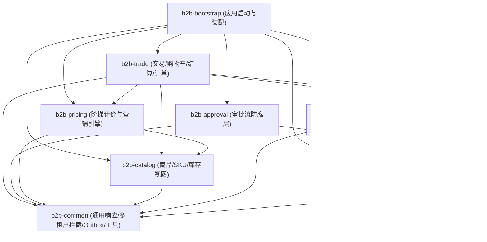
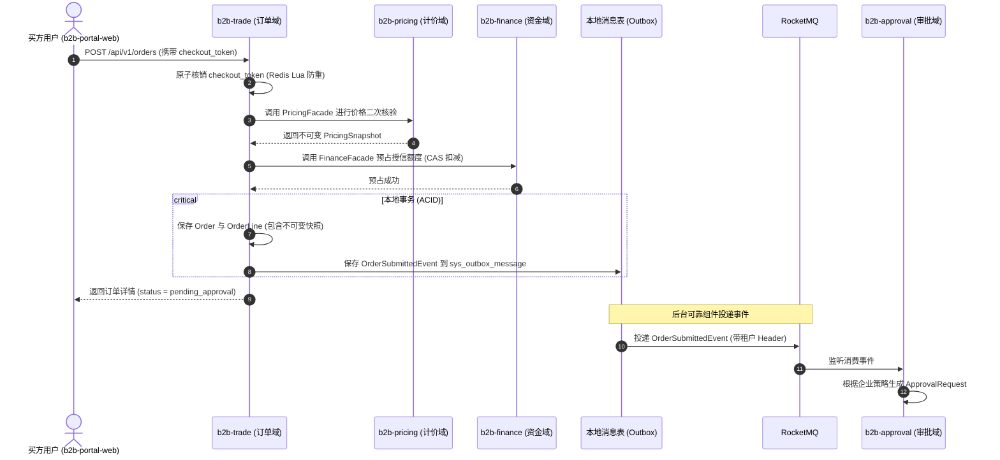

# 功能设计与 SQL 架构留档：项目脚手架与基础架构初始化

- **功能编号**：`01`
- **模块名称**：`project-scaffolding-and-foundation`
- **关联 ADR**：ADR 0001 ~ ADR 0010
- **对齐前端**：`D:\b2bCoding\b2b-portal-web`

---

## 1. 业务背景与用例说明

企采云对公商城（`b2b-commerce-backend`）为企业级买方提供从选品、协议阶梯算价、批量采购、结算确认到审批流转的全链路后端服务。前端已有 MVP 版本（`b2b-portal-web`），后端需建立与之 100% 契约对齐的领域驱动模块化单体架构。

本阶段目标：
1. 建立 Maven 多模块工程骨架，明确模块间单向依赖边界，杜绝循环依赖与跨模块直接查库；
2. 搭建以 `Java 21 + Spring Boot 3.3.4 + MyBatis-Plus 3.5.7 + PostgreSQL 16` 为核心的技术底座；
3. 实现多租户上下文安全穿透容器（`TenantContext`），在 SQL 执行期自动追加 `company_id` 过滤；
4. 实现前后端统一响应格式 `ApiResponse<T>` 与全局业务异常体系；
5. 设计并版本化 PostgreSQL 16 初始数据库模式（包含 JSONB 快照与 GIN 索引）。

---

## 2. 领域模型与架构拓扑

### 2.1 模块依赖流向 (DAG)



### 2.2 核心业务时序图（订单提交与审批触发解耦）



---

## 3. 接口契约规范 (REST API)

### 3.1 统一响应结构
所有 Controller 返回必须由 `ApiResponse<T>` 承载：
```json
{
  "code": 200,
  "message": "success",
  "data": {},
  "timestamp": 1726758400000
}
```

### 3.2 基础错误码枚举
- `200`: 成功
- `400`: 请求参数校验失败（如 SKU 编码格式非法）
- `401`: 未认证或 Token 已过期
- `403`: 无权访问目标企业上下文（多租户越权拦截）
- `409`: 重复提交（`CHECKOUT_TOKEN_INVALID`）
- `500`: 系统内部异常
- `2001`: 授信可用额度不足（`CREDIT_LIMIT_EXCEEDED`）
- `2002`: SKU 库存不足或已下架（`SKU_OUT_OF_STOCK`）
- `2003`: 价格发生变动，请重新确认（`PRICE_CHANGED`）

---

## 4. 数据库与 SQL 设计 (PostgreSQL 16)

### 4.1 设计考量与特性运用
1. **JSONB 原生支持**：
   - `pms_sku.attributes`：工业品动态规格（材质、耐温、公差等），通过 GIN 倒排索引支持任意键值毫秒级查询；
   - `oms_order_line.pricing_snapshot`：阶梯命中轨迹与优惠分摊不可变快照；
   - `oms_order.shipping_address_snapshot` 与 `invoice_snapshot`：收货与开票快照。
2. **多租户数据隔离**：
   - 所有租户数据表包含 `company_id VARCHAR(64) NOT NULL`；
   - 建立 `(company_id, ...)` 联合复合索引；
   - 支持内核级 RLS（Row-Level Security）。
3. **高并发与防死锁**：
   - `sys_outbox_message` 支持 `FOR UPDATE SKIP LOCKED` 高并发拉取。

### 4.2 初始数据库建表 DDL (Flyway V1.0.0)

```sql
-- 启用 pg_trgm 扩展以支持 SKU/OEM 模糊检索
CREATE EXTENSION IF NOT EXISTS "pg_trgm";

-- ========================================================
-- 1. 系统与本地消息表 (Outbox)
-- ========================================================
CREATE TABLE sys_outbox_message (
    id BIGINT PRIMARY KEY,
    company_id VARCHAR(64) NOT NULL,
    event_id VARCHAR(64) NOT NULL UNIQUE,
    event_type VARCHAR(128) NOT NULL,
    payload JSONB NOT NULL,
    status VARCHAR(32) NOT NULL DEFAULT 'PENDING',
    retry_count INT NOT NULL DEFAULT 0,
    next_retry_time TIMESTAMPTZ,
    created_at TIMESTAMPTZ NOT NULL DEFAULT CURRENT_TIMESTAMP,
    updated_at TIMESTAMPTZ NOT NULL DEFAULT CURRENT_TIMESTAMP
);
CREATE INDEX idx_outbox_status_retry ON sys_outbox_message(status, next_retry_time);

-- ========================================================
-- 2. 组织与用户域 (IAM)
-- ========================================================
CREATE TABLE org_company (
    id VARCHAR(64) PRIMARY KEY,
    name VARCHAR(255) NOT NULL,
    short_name VARCHAR(128) NOT NULL,
    tax_id VARCHAR(64) NOT NULL UNIQUE,
    customer_tier VARCHAR(32) NOT NULL DEFAULT 'standard',
    is_verified BOOLEAN NOT NULL DEFAULT true,
    credit_limit NUMERIC(14, 2) NOT NULL DEFAULT 0.00,
    credit_used NUMERIC(14, 2) NOT NULL DEFAULT 0.00,
    payment_term_days INT NOT NULL DEFAULT 30,
    currency VARCHAR(16) NOT NULL DEFAULT 'CNY',
    created_at TIMESTAMPTZ NOT NULL DEFAULT CURRENT_TIMESTAMP,
    updated_at TIMESTAMPTZ NOT NULL DEFAULT CURRENT_TIMESTAMP,
    deleted BOOLEAN NOT NULL DEFAULT false
);

CREATE TABLE org_user (
    id VARCHAR(64) PRIMARY KEY,
    name VARCHAR(128) NOT NULL,
    email VARCHAR(128) NOT NULL UNIQUE,
    password_hash VARCHAR(255) NOT NULL,
    department VARCHAR(128),
    avatar_text VARCHAR(32),
    created_at TIMESTAMPTZ NOT NULL DEFAULT CURRENT_TIMESTAMP,
    updated_at TIMESTAMPTZ NOT NULL DEFAULT CURRENT_TIMESTAMP,
    deleted BOOLEAN NOT NULL DEFAULT false
);

CREATE TABLE org_membership (
    id BIGINT PRIMARY KEY,
    user_id VARCHAR(64) NOT NULL REFERENCES org_user(id),
    company_id VARCHAR(64) NOT NULL REFERENCES org_company(id),
    role VARCHAR(32) NOT NULL DEFAULT 'buyer',
    created_at TIMESTAMPTZ NOT NULL DEFAULT CURRENT_TIMESTAMP,
    updated_at TIMESTAMPTZ NOT NULL DEFAULT CURRENT_TIMESTAMP,
    UNIQUE (user_id, company_id)
);

-- ========================================================
-- 3. 商品与目录域 (Catalog)
-- ========================================================
CREATE TABLE pms_category (
    id VARCHAR(64) PRIMARY KEY,
    name VARCHAR(128) NOT NULL,
    description TEXT,
    parent_id VARCHAR(64),
    sort_order INT NOT NULL DEFAULT 0,
    created_at TIMESTAMPTZ NOT NULL DEFAULT CURRENT_TIMESTAMP,
    updated_at TIMESTAMPTZ NOT NULL DEFAULT CURRENT_TIMESTAMP
);

CREATE TABLE pms_product (
    id VARCHAR(64) PRIMARY KEY,
    slug VARCHAR(128) NOT NULL UNIQUE,
    title VARCHAR(255) NOT NULL,
    subtitle VARCHAR(255),
    brand VARCHAR(128) NOT NULL,
    category_id VARCHAR(64) NOT NULL REFERENCES pms_category(id),
    description TEXT,
    unit VARCHAR(32) NOT NULL DEFAULT '件',
    default_sku_id VARCHAR(64),
    tone VARCHAR(32),
    accent VARCHAR(32),
    mark VARCHAR(32),
    badges JSONB NOT NULL DEFAULT '[]'::jsonb,
    tags JSONB NOT NULL DEFAULT '[]'::jsonb,
    status VARCHAR(32) NOT NULL DEFAULT 'active',
    is_featured BOOLEAN NOT NULL DEFAULT false,
    created_at TIMESTAMPTZ NOT NULL DEFAULT CURRENT_TIMESTAMP,
    updated_at TIMESTAMPTZ NOT NULL DEFAULT CURRENT_TIMESTAMP
);

CREATE TABLE pms_sku (
    id VARCHAR(64) PRIMARY KEY,
    product_id VARCHAR(64) NOT NULL REFERENCES pms_product(id),
    code VARCHAR(64) NOT NULL UNIQUE,
    name VARCHAR(255) NOT NULL,
    attributes JSONB NOT NULL DEFAULT '{}'::jsonb,
    unit VARCHAR(32) NOT NULL DEFAULT '件',
    price NUMERIC(12, 2) NOT NULL,
    list_price NUMERIC(12, 2),
    currency VARCHAR(16) NOT NULL DEFAULT 'CNY',
    stock INT NOT NULL DEFAULT 0,
    availability VARCHAR(32) NOT NULL DEFAULT 'in_stock',
    lead_time_label VARCHAR(64) NOT NULL DEFAULT '现货，工作日当日发货',
    status VARCHAR(32) NOT NULL DEFAULT 'available',
    weight_kg NUMERIC(8, 2),
    created_at TIMESTAMPTZ NOT NULL DEFAULT CURRENT_TIMESTAMP,
    updated_at TIMESTAMPTZ NOT NULL DEFAULT CURRENT_TIMESTAMP
);
CREATE INDEX idx_sku_attributes_gin ON pms_sku USING gin (attributes);
CREATE INDEX idx_sku_code_trgm ON pms_sku USING gin (code gin_trgm_ops);

-- ========================================================
-- 4. 价格与阶梯价域 (Pricing)
-- ========================================================
CREATE TABLE price_tier (
    id BIGINT PRIMARY KEY,
    sku_id VARCHAR(64) NOT NULL REFERENCES pms_sku(id),
    min_quantity INT NOT NULL,
    unit_price NUMERIC(12, 2) NOT NULL,
    label VARCHAR(128),
    created_at TIMESTAMPTZ NOT NULL DEFAULT CURRENT_TIMESTAMP,
    updated_at TIMESTAMPTZ NOT NULL DEFAULT CURRENT_TIMESTAMP
);
CREATE INDEX idx_tier_sku_qty ON price_tier(sku_id, min_quantity);

-- ========================================================
-- 5. 交易与订单域 (Trade)
-- ========================================================
CREATE TABLE oms_order (
    id VARCHAR(64) PRIMARY KEY,
    order_no VARCHAR(64) NOT NULL UNIQUE,
    company_id VARCHAR(64) NOT NULL,
    created_by VARCHAR(64) NOT NULL,
    status VARCHAR(32) NOT NULL DEFAULT 'pending_approval',
    approval_status VARCHAR(32) NOT NULL DEFAULT 'pending',
    payment_method VARCHAR(32) NOT NULL,
    subtotal NUMERIC(14, 2) NOT NULL,
    list_subtotal NUMERIC(14, 2) NOT NULL,
    promotion_discount NUMERIC(14, 2) NOT NULL DEFAULT 0.00,
    shipping_fee NUMERIC(14, 2) NOT NULL DEFAULT 0.00,
    tax NUMERIC(14, 2) NOT NULL DEFAULT 0.00,
    total NUMERIC(14, 2) NOT NULL,
    currency VARCHAR(16) NOT NULL DEFAULT 'CNY',
    shipping_address_snapshot JSONB NOT NULL,
    invoice_snapshot JSONB,
    note TEXT,
    requested_delivery_date DATE,
    submitted_at TIMESTAMPTZ,
    created_at TIMESTAMPTZ NOT NULL DEFAULT CURRENT_TIMESTAMP,
    updated_at TIMESTAMPTZ NOT NULL DEFAULT CURRENT_TIMESTAMP,
    deleted BOOLEAN NOT NULL DEFAULT false
);
CREATE INDEX idx_order_company_status ON oms_order(company_id, status);

CREATE TABLE oms_order_line (
    id VARCHAR(64) PRIMARY KEY,
    order_id VARCHAR(64) NOT NULL REFERENCES oms_order(id),
    product_id VARCHAR(64) NOT NULL,
    sku_id VARCHAR(64) NOT NULL,
    sku_code VARCHAR(64) NOT NULL,
    product_title VARCHAR(255) NOT NULL,
    sku_name VARCHAR(255) NOT NULL,
    attributes JSONB NOT NULL DEFAULT '{}'::jsonb,
    unit VARCHAR(32) NOT NULL,
    quantity INT NOT NULL,
    unit_price NUMERIC(12, 2) NOT NULL,
    list_unit_price NUMERIC(12, 2),
    promotion_discount NUMERIC(12, 2) NOT NULL DEFAULT 0.00,
    subtotal NUMERIC(14, 2) NOT NULL,
    pricing_snapshot JSONB,
    created_at TIMESTAMPTZ NOT NULL DEFAULT CURRENT_TIMESTAMP
);
CREATE INDEX idx_order_line_order ON oms_order_line(order_id);

-- ========================================================
-- 6. 审批域 (Approval)
-- ========================================================
CREATE TABLE act_approval_request (
    id VARCHAR(64) PRIMARY KEY,
    order_id VARCHAR(64) NOT NULL UNIQUE,
    order_no VARCHAR(64) NOT NULL,
    company_id VARCHAR(64) NOT NULL,
    status VARCHAR(32) NOT NULL DEFAULT 'pending',
    current_node VARCHAR(64) NOT NULL DEFAULT '待审批',
    submitted_by VARCHAR(64) NOT NULL,
    timeline JSONB NOT NULL DEFAULT '[]'::jsonb,
    created_at TIMESTAMPTZ NOT NULL DEFAULT CURRENT_TIMESTAMP,
    updated_at TIMESTAMPTZ NOT NULL DEFAULT CURRENT_TIMESTAMP
);
CREATE INDEX idx_approval_company_status ON act_approval_request(company_id, status);
```
