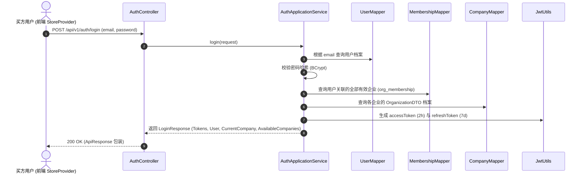
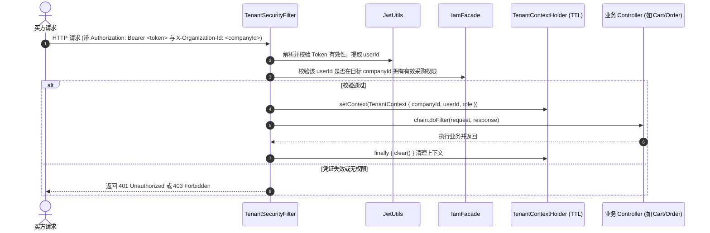

# 功能设计与 SQL 架构留档：组织与用户认证模块 (b2b-iam)

- **功能编号**：`02`
- **模块名称**：`iam-and-auth`
- **所属限界上下文**：`b2b-iam`
- **关联 ADR**：ADR 0005（多租户上下文传递）、ADR 0008（双 Token 鉴权与组织切换）
- **对齐前端**：`D:\b2bCoding\b2b-portal-web`（`StoreProvider`、`CompanyProfile`、`UserProfile`）

---

## 1. 业务背景与用例说明

在对公 B2B 商城中，买方用户（BuyerUser）不代表个人消费，而是代表特定的客户企业（CustomerOrganization）进行采购。系统必须支持：
1. **买方登录与鉴权**：用户使用企业邮箱与密码登录，验证通过后发放访问凭证（Access Token）与刷新凭证（Refresh Token）；
2. **多企业成员关系与授权**：一个买方可能受雇或受托于多家关联企业（通过 `org_membership` 关联），登录时返回其所有有权访问的企业列表；
3. **组织上下文切换（ActiveOrganizationContext）**：买方在前端切换代表的企业时，后端校验其合法性并切换当前工作上下文，后续所有价格、购物车与订单均隔离在该企业下；
4. **会话快照（SessionSnapshot）**：提供对齐前端 `SessionState` 契约的会话查询接口，返回当前登录用户、当前选定企业及企业授信/账期档案。

---

## 2. 领域模型与交互时序图

### 2.1 用户登录与会话初始化时序图



### 2.2 业务请求多租户拦截与上下文穿透时序图



---

## 3. 接口契约规范 (REST API)

### 3.1 用户登录接口
- **URL**：`POST /api/v1/auth/login`
- **请求体**：
  ```json
  {
    "email": "procurement@lantu-mfg.example",
    "password": "password123"
  }
  ```
- **响应体** (`data`)：
  ```json
  {
    "accessToken": "eyJhbGciOi...",
    "refreshToken": "eyJhbGciOi...",
    "expiresIn": 7200,
    "user": {
      "id": "user-lin-yue",
      "name": "林悦",
      "role": "buyer",
      "department": "采购部",
      "avatarText": "蓝图",
      "companyId": "company-lantu"
    },
    "currentCompany": {
      "id": "company-lantu",
      "name": "深圳市蓝图精密制造有限公司",
      "shortName": "蓝图精密制造",
      "taxId": "91440300MA5F8N7X2K",
      "customerTier": "gold",
      "isVerified": true,
      "creditLimit": 1280000.00,
      "creditUsed": 409600.00,
      "paymentTermDays": 30,
      "currency": "CNY"
    },
    "availableCompanies": [ ... ]
  }
  ```

### 3.2 获取当前会话状态 (Session Snapshot)
- **URL**：`GET /api/v1/auth/session`
- **Header**：
  - `Authorization: Bearer <accessToken>`
  - `X-Organization-Id: company-lantu`
- **响应体** (`data`)：
  ```json
  {
    "authenticated": true,
    "email": "procurement@lantu-mfg.example",
    "user": { ... },
    "company": { ... }
  }
  ```

### 3.3 切换当前企业上下文
- **URL**：`POST /api/v1/auth/switch-context`
- **请求体**：
  ```json
  {
    "targetCompanyId": "company-lantu"
  }
  ```

---

## 4. 数据库与 SQL 设计

### 4.1 数据表复用与索引
本模块完全基于 `V1.0.0__init_schema.sql` 中的三张基础表：
1. `org_company`：企业组织档案、统一社会信用代码、客群等级、授信与账期天数；
2. `org_user`：买方用户账号、邮箱（唯一索引 `org_user_email_key`）、BCrypt 密码散列、部门；
3. `org_membership`：用户与企业的所属关系，联合唯一索引 `UNIQUE (user_id, company_id)`。

### 4.2 初始化种子数据 (Flyway V1.0.1)
为保证与前端原型零门槛快速联调，在 `V1.0.1__seed_iam_data.sql` 中插入与前端 `mock-data.ts` 完全一致的演示数据：
- 默认企业：`深圳市蓝图精密制造有限公司` (`company-lantu`)，授信 128 万，已用 40.96 万，30 天账期；
- 默认买方：`林悦` (`user-lin-yue`)，邮箱 `procurement@lantu-mfg.example`，密码 `123456`。
