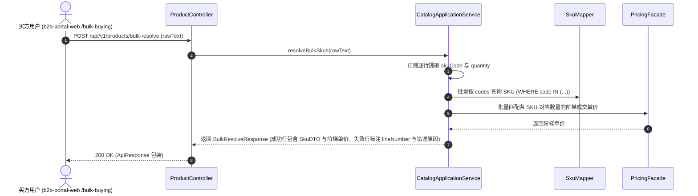
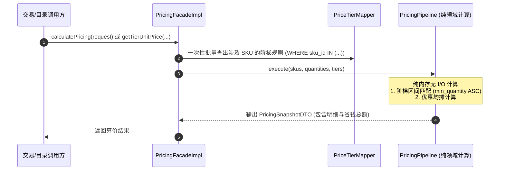

# 功能设计与 SQL 架构留档：商品与阶梯价目录模块 (b2b-catalog & b2b-pricing)

- **功能编号**：`03`
- **模块名称**：`catalog-and-pricing`
- **所属限界上下文**：`b2b-catalog` & `b2b-pricing`
- **关联 ADR**：ADR 0006（纯领域算价流水线与可解释快照）、ADR 0010（PostgreSQL 16 JSONB 与 GIN 检索）
- **对齐前端**：`D:\b2bCoding\b2b-portal-web`（`Product`、`ProductSku`、`PriceTier`、`CatalogFilters`、`BulkSkuRow`）

---

## 1. 业务背景与用例说明

对公采购商城的选品与计价具有典型的企业级特征：
1. **多层级规格模型（SPU/SKU）**：Product 作为展示归类族，SKU 作为唯一可交易单位，包含动态技术规格（`attributes`，如材质、内径、转速等）；
2. **多维筛选与模糊检索**：买方可通过品类层级、品牌、现货状态、价格区间以及综合/价格/上架时间排序浏览商品；
3. **批量采购清单快速录入（Bulk Buying）**：企业采购人员常需一次性采购几十上百种备件。系统提供批量解析接口，输入 `SKU编码 + 数量` 文本或清单，逐行比对商品合法性、起订量并给出可读的错误反馈；
4. **纯内存阶梯算价流水线（Pricing Pipeline）**：不同采购数量命中不同的阶梯优惠（如 1+ 协议价、50+ 优惠价、100+ 大宗特惠），算价过程无任何外部 I/O 副作用，并输出结构化可解释快照。

---

## 2. 领域模型与交互时序图

### 2.1 批量采购清单解析时序图 (Bulk Resolve)



### 2.2 纯领域无副作用阶梯算价时序图



---

## 3. 接口契约规范 (REST API)

### 3.1 商品品类列表
- **URL**：`GET /api/v1/categories`
- **响应体** (`data`)：
  ```json
  [
    {
      "id": "precision-parts",
      "name": "精密零件",
      "description": "轴承、联轴器及机械传动件",
      "productCount": 12
    }
  ]
  ```

### 3.2 商品目录搜索与筛选
- **URL**：`GET /api/v1/products`
- **Query 参数**：
  - `query`：搜索关键词（支持标题、品牌、SKU 编码）
  - `categoryId`：品类 ID
  - `brand`：品牌筛选
  - `availability`：库存状态（`in_stock`, `low_stock`, `preorder`, `out_of_stock`）
  - `minPrice` / `maxPrice`：价格区间
  - `sortBy`：`recommended` / `price_asc` / `price_desc` / `newest`
  - `page` / `pageSize`：分页参数（默认第 1 页，每页 20 条）
- **响应体** (`data`)：包含 `items`、`total`、`page`、`pageSize`、`totalPages` 的分页对象。

### 3.3 商品与 SKU 详情查询
- **URL**：`GET /api/v1/products/{id}`
- **响应体** (`data`)：完整的 `ProductDTO`，包含下属所有 `SkuDTO` 及其 `priceTiers` 阶梯价列表。

### 3.4 批量采购清单解析
- **URL**：`POST /api/v1/products/bulk-resolve`
- **请求体**：
  ```json
  {
    "rawText": "SKU-NSK-6205ZZ 100\nSKU-SICK-WL12G3 20\nINVALID-SKU 10"
  }
  ```
- **响应体** (`data`)：
  ```json
  {
    "successCount": 2,
    "errorCount": 1,
    "rows": [
      {
        "lineNumber": 1,
        "raw": "SKU-NSK-6205ZZ 100",
        "skuCode": "SKU-NSK-6205ZZ",
        "quantity": 100,
        "sku": { ... },
        "unitPrice": 16.74,
        "error": null
      },
      {
        "lineNumber": 3,
        "raw": "INVALID-SKU 10",
        "skuCode": "INVALID-SKU",
        "quantity": 10,
        "sku": null,
        "unitPrice": null,
        "error": "SKU 编码不存在或已停售"
      }
    ]
  }
  ```

---

## 4. 数据库与 SQL 设计

### 4.1 数据表定义与 PostgreSQL 16 特性
1. `pms_category`：品类树与排序；
2. `pms_product`：商品族档案，`badges` 与 `tags` 使用 PostgreSQL `jsonb` 格式存储；
3. `pms_sku`：可交易库存单位，动态技术参数 `attributes` 使用 `jsonb`，配合 GIN 倒排索引；
4. `price_tier`：阶梯价格区间表，联合索引 `(sku_id, min_quantity)` 优化范围扫描。

### 4.2 种子数据 (Flyway V1.0.2)
初始化 5 大核心品类、代表性工业备件（NSK 深沟球轴承、SICK 光电传感器、安川伺服电机）及对应阶梯价规则。
