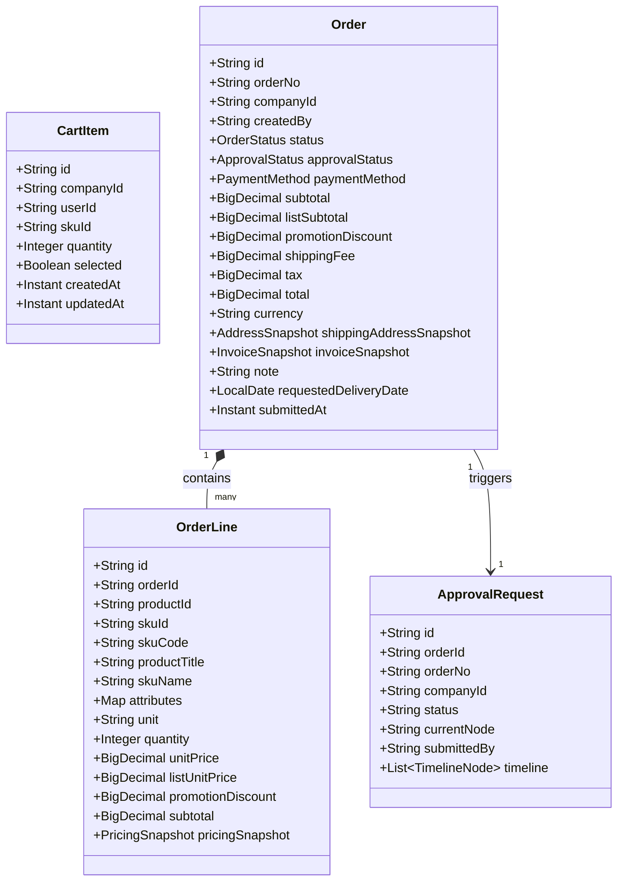
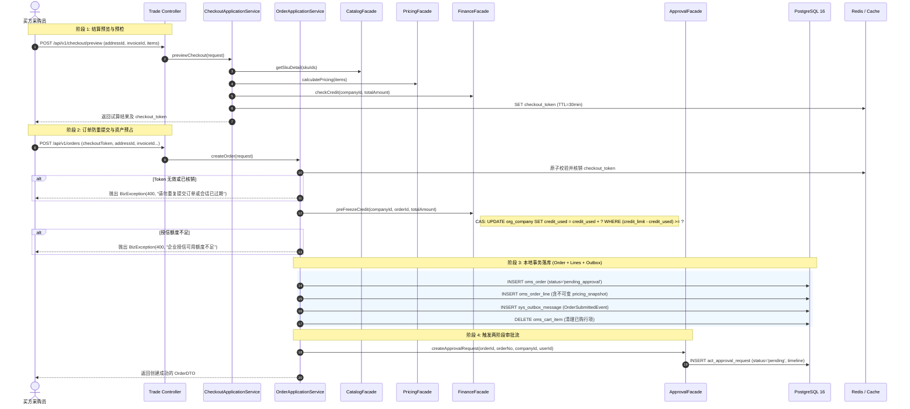

# 04. 交易购物车与订单中心架构与详细设计留档

> **文档状态**：已冻结 (Approved)  
> **关联 ADR**：ADR 0001 (模块化单体), ADR 0003 (两阶段审批状态机), ADR 0004 (本地消息表 Outbox), ADR 0006 (纯内存算价流水线), ADR 0007 (并发控制与 Token 幂等), ADR 0010 (PostgreSQL 16)  
> **前端对齐**：`D:\b2bCoding\b2b-portal-web` (`domain.ts`, `mock-data.ts`, `store-provider.tsx`)

---

## 1. 业务背景与用例

在企采云 B2B 对公商城中，交易是整个采购履约流程的核心骨干。与普通 B2C 电商相比，企业对公采购具有以下核心差异点与关键诉求：
1. **企业多买方与跨端采购车协同**：企业采购员往往跨设备、跨工作日进行批量选品，采购车行项必须具备服务端持久化与企业租户隔离（`company_id`），支持增删改查、批量勾选、同 SKU 智能合并以及基于阶梯价（Price Tier）的实时动态金额重算。
2. **结算试算与防重 Token（Idempotency Token）**：在提交订单前，采购员进入结算页必须先调用试算接口，系统实时校验配送地址、开票资质、商品可售库存，并调用资金域预检企业当前可用授信额度（Credit Limit）；同时生成 30 分钟有效的 `checkout_token`，确保订单提交接口严格幂等。
3. **不可变快照原则（Immutable Snapshots）**：订单生成瞬间，其成交单价、阶梯命中信息、运费、税费、收货地址及开票资质必须永久“冻结”为不可变快照（以 PostgreSQL `jsonb` 存储在订单与订单行中），即使后续商品调价、企业资质变更或地址修改，历史订单数据绝对不可变。
4. **两阶段审批状态机（Two-Stage Approval）**：买方提交订单后，初始状态必须且只能为 `pending_approval`（待审批）。前端买方无“审批通过/驳回”权限，由后台审批工作流通过 `ApprovalFacade` 推进，审批完成后方可进入待支付或履约中。
5. **CAS 授信并发预占与本地消息表（Outbox）**：信用账期支付模式下，订单提交时通过数据库 CAS 乐观更新预占授信额度；订单数据持久化与 `OrderSubmittedEvent` 本地消息落库在同一本地事务中完成，保障分布式最终一致性。

---

## 2. 领域模型与交互时序图

### 2.1 核心领域对象关系 (Domain Model)



### 2.2 订单提交流程时序图 (Order Submission Sequence)



---

## 3. 接口契约定义 (API Specifications)

### 3.1 采购车接口 (`CartController`)

| 方法 | 路径 | 说明 | 请求体 | 响应体 |
| :--- | :--- | :--- | :--- | :--- |
| `GET` | `/api/v1/cart` | 获取当前企业采购车 | 无 | `ApiResponse<CartDTO>` |
| `POST` | `/api/v1/cart/items` | 添加商品至采购车 | `AddToCartRequest` | `ApiResponse<CartDTO>` |
| `PUT` | `/api/v1/cart/items/{id}/quantity` | 修改采购车行数量 | `UpdateCartQuantityRequest` | `ApiResponse<CartDTO>` |
| `PUT` | `/api/v1/cart/items/{id}/select` | 切换单个商品勾选状态 | 无 | `ApiResponse<CartDTO>` |
| `PUT` | `/api/v1/cart/items/batch-select` | 批量勾选/取消勾选商品 | `BatchSelectCartRequest` | `ApiResponse<CartDTO>` |
| `DELETE` | `/api/v1/cart/items/{id}` | 删除采购车单行项 | 无 | `ApiResponse<CartDTO>` |
| `DELETE` | `/api/v1/cart/clear` | 清空当前企业采购车 | 无 | `ApiResponse<Void>` |

#### `CartDTO` 结构 (完全对齐前端 `Cart`)
```json
{
  "code": 200,
  "message": "success",
  "data": {
    "id": "cart_company_lantu",
    "companyId": "company-lantu",
    "currency": "CNY",
    "items": [
      {
        "id": "cart_item_1",
        "productId": "prod-nsk-6205",
        "categoryId": "transmission-parts",
        "skuId": "sku-nsk-6205-zz",
        "skuCode": "SKU-NSK-6205-ZZ",
        "productTitle": "NSK 深沟球轴承 6205ZZ",
        "skuName": "6205ZZ · 25×52×15 mm",
        "unit": "套",
        "unitPrice": 26.50,
        "listUnitPrice": 32.00,
        "quantity": 12,
        "selected": true,
        "promotionIds": ["promo-september-agreement"],
        "addedAt": "2026-09-19T10:00:00Z"
      }
    ],
    "couponCode": null,
    "totals": {
      "currency": "CNY",
      "itemCount": 12,
      "subtotal": 318.00,
      "listSubtotal": 384.00,
      "promotionDiscount": 66.00,
      "shippingFee": 0.00,
      "tax": 0.00,
      "total": 318.00
    },
    "updatedAt": "2026-09-19T10:00:00Z"
  },
  "timestamp": 1726758400000
}
```

---

### 3.2 结算试算会话接口 (`CheckoutController`)

| 方法 | 路径 | 说明 | 请求体 | 响应体 |
| :--- | :--- | :--- | :--- | :--- |
| `POST` | `/api/v1/checkout/preview` | 结算金额试算与防重 Token 预领 | `CheckoutPreviewRequest` | `ApiResponse<CheckoutPreviewDTO>` |

#### `CheckoutPreviewDTO` 响应结构 (对齐 `CheckoutState`)
```json
{
  "code": 200,
  "message": "success",
  "data": {
    "checkoutToken": "550e8400-e29b-41d4-a716-446655440000",
    "tokenExpiresInSeconds": 1800,
    "items": [ ... ],
    "totals": {
      "currency": "CNY",
      "itemCount": 12,
      "subtotal": 318.00,
      "listSubtotal": 384.00,
      "promotionDiscount": 66.00,
      "shippingFee": 0.00,
      "tax": 0.00,
      "total": 318.00
    },
    "selectedAddress": { ... },
    "selectedInvoice": { ... },
    "creditCheck": {
      "companyId": "company-lantu",
      "creditLimit": 500000.00,
      "creditUsed": 128000.00,
      "availableCredit": 372000.00,
      "requestAmount": 318.00,
      "isSufficient": true
    }
  },
  "timestamp": 1726758400000
}
```

---

### 3.3 采购订单管理接口 (`OrderController`)

| 方法 | 路径 | 说明 | 请求体 | 响应体 |
| :--- | :--- | :--- | :--- | :--- |
| `POST` | `/api/v1/orders` | 提交生成采购订单 (幂等核销) | `CreateOrderRequest` | `ApiResponse<OrderDTO>` |
| `GET` | `/api/v1/orders` | 分页查询当前企业订单列表 | QueryParams (`page`, `pageSize`, `status`, `query`) | `ApiResponse<PageResult<OrderDTO>>` |
| `GET` | `/api/v1/orders/{id}` | 查询采购订单详情与审批轨迹 | PathParam (`id`) | `ApiResponse<OrderDTO>` |

#### `CreateOrderRequest` 请求体
```json
{
  "checkoutToken": "550e8400-e29b-41d4-a716-446655440000",
  "addressId": "addr-shenzhen-factory",
  "invoiceId": "invoice-special-default",
  "paymentMethod": "credit_account",
  "note": "加急发货，用于生产线周检替换",
  "requestedDeliveryDate": "2026-09-25",
  "items": null
}
```
*注：`items` 为空时默认结算采购车中所有 `selected = true` 的行项；不为空时支持直接从商品详情页快速下单（Buy Now）。*

---

## 4. 数据库与 SQL 设计 (PostgreSQL 16)

### 4.1 建表 DDL (Flyway `V1.0.3__trade_and_finance_schema.sql`)

```sql
-- ========================================================
-- 1. 采购车行项表 (oms_cart_item)
-- ========================================================
CREATE TABLE IF NOT EXISTS oms_cart_item (
    id VARCHAR(64) PRIMARY KEY,
    company_id VARCHAR(64) NOT NULL,
    user_id VARCHAR(64) NOT NULL,
    sku_id VARCHAR(64) NOT NULL REFERENCES pms_sku(id),
    quantity INT NOT NULL DEFAULT 1,
    selected BOOLEAN NOT NULL DEFAULT true,
    created_at TIMESTAMPTZ NOT NULL DEFAULT CURRENT_TIMESTAMP,
    updated_at TIMESTAMPTZ NOT NULL DEFAULT CURRENT_TIMESTAMP,
    CONSTRAINT uk_cart_company_user_sku UNIQUE (company_id, user_id, sku_id)
);
CREATE INDEX IF NOT EXISTS idx_cart_company_user ON oms_cart_item(company_id, user_id);

-- ========================================================
-- 2. 企业地址档案表 (fms_company_address)
-- ========================================================
CREATE TABLE IF NOT EXISTS fms_company_address (
    id VARCHAR(64) PRIMARY KEY,
    company_id VARCHAR(64) NOT NULL REFERENCES org_company(id),
    label VARCHAR(128) NOT NULL,
    kind VARCHAR(32) NOT NULL DEFAULT 'shipping', -- shipping: 收货地址, billing: 开票地址
    recipient VARCHAR(128) NOT NULL,
    phone VARCHAR(32) NOT NULL,
    province VARCHAR(64) NOT NULL,
    city VARCHAR(64) NOT NULL,
    district VARCHAR(64) NOT NULL,
    detail VARCHAR(255) NOT NULL,
    postal_code VARCHAR(32),
    is_default BOOLEAN NOT NULL DEFAULT false,
    created_at TIMESTAMPTZ NOT NULL DEFAULT CURRENT_TIMESTAMP,
    updated_at TIMESTAMPTZ NOT NULL DEFAULT CURRENT_TIMESTAMP,
    deleted BOOLEAN NOT NULL DEFAULT false
);
CREATE INDEX IF NOT EXISTS idx_addr_company_kind ON fms_company_address(company_id, kind);

-- ========================================================
-- 3. 企业开票资质档案表 (fms_invoice_profile)
-- ========================================================
CREATE TABLE IF NOT EXISTS fms_invoice_profile (
    id VARCHAR(64) PRIMARY KEY,
    company_id VARCHAR(64) NOT NULL REFERENCES org_company(id),
    type VARCHAR(32) NOT NULL DEFAULT 'vat_special', -- vat_special: 增值税专用发票, vat_normal: 普通发票, electronic: 电子发票
    title VARCHAR(255) NOT NULL,
    tax_id VARCHAR(64) NOT NULL,
    bank_name VARCHAR(128),
    bank_account VARCHAR(64),
    registered_address VARCHAR(255),
    registered_phone VARCHAR(32),
    receive_email VARCHAR(128) NOT NULL,
    status VARCHAR(32) NOT NULL DEFAULT 'active', -- active: 正常, pending_verification: 待核验, disabled: 停用
    is_default BOOLEAN NOT NULL DEFAULT false,
    created_at TIMESTAMPTZ NOT NULL DEFAULT CURRENT_TIMESTAMP,
    updated_at TIMESTAMPTZ NOT NULL DEFAULT CURRENT_TIMESTAMP,
    deleted BOOLEAN NOT NULL DEFAULT false
);
CREATE INDEX IF NOT EXISTS idx_invoice_company_status ON fms_invoice_profile(company_id, status);
```

### 4.2 字段与快照设计考量
1. **不可变快照 JSONB 格式**：
   - `oms_order.shipping_address_snapshot`：
     `{"id": "...", "label": "...", "kind": "shipping", "recipient": "...", "phone": "...", "province": "...", "city": "...", "district": "...", "detail": "...", "postalCode": "..."}`
   - `oms_order.invoice_snapshot`：
     `{"id": "...", "type": "vat_special", "title": "...", "taxId": "...", "bankName": "...", "bankAccount": "...", "registeredAddress": "...", "registeredPhone": "...", "receiveEmail": "..."}`
   - `oms_order_line.pricing_snapshot`：
     `{"skuId": "...", "quantity": 12, "originalUnitPrice": 32.00, "finalUnitPrice": 26.50, "hitTier": {"minQuantity": 10, "unitPrice": 26.50, "label": "10+ 阶梯价"}}`
2. **PostgreSQL 索引优化**：
   - `idx_cart_company_user` 覆盖多租户买方快速定位；
   - `idx_order_company_status` 支撑企业订单中心多维度状态筛选；
   - `idx_approval_company_status` 支撑审批工作台迅速加载待办任务。

---

## 5. 并发防重、分布式事务与异常降级方案

1. **防重提交原子性（Idempotency）**：
   - 前端在进入结算确认时通过 `POST /api/v1/checkout/preview` 领取 `checkoutToken`；
   - 提交订单时，后端通过 Redisson 分布式原子锁 / Redis Lua 脚本（或单机并发原子原子标记）核销 Token：
     若 Token 不存在或已核销，直接阻断并抛出 `BizException(ResultCode.REPEAT_SUBMISSION, "请勿重复提交订单或会话已过期")`。
2. **CAS 乐观预占企业授信（Optimistic Concurrency）**：
   - 在账期支付模式下，执行 SQL：
     ```sql
     UPDATE org_company 
     SET credit_used = credit_used + #{amount}, updated_at = NOW() 
     WHERE id = #{companyId} AND (credit_limit - credit_used) >= #{amount};
     ```
   - 若影响行数为 0，说明额度不足或被并发占用，直接回滚并抛出 `BizException(ResultCode.INSUFFICIENT_CREDIT, "企业可用授信额度不足")`。
3. **本地消息表 Outbox 事务保障**：
   - `OrderPO`、`OrderLinePO`、`sys_outbox_message`（事件类型 `OrderSubmittedEvent`）在同一本地 Spring 声明式事务（`@Transactional(rollbackFor = Exception.class)`）中提交；
   - 彻底避免由于 MQ 发送抖动导致的分布式不一致漏洞。
4. **审批流程降级保障**：
   - 订单入库后，同步调用 `ApprovalFacade.createApprovalRequest` 生成待审批工作项；
   - 若审批服务偶发异常，Outbox 消息补偿机制可再次投递事件完成重试补单。
