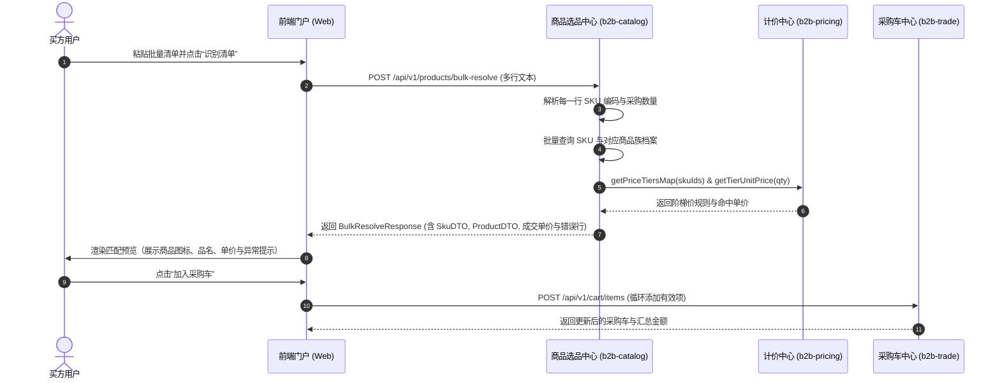
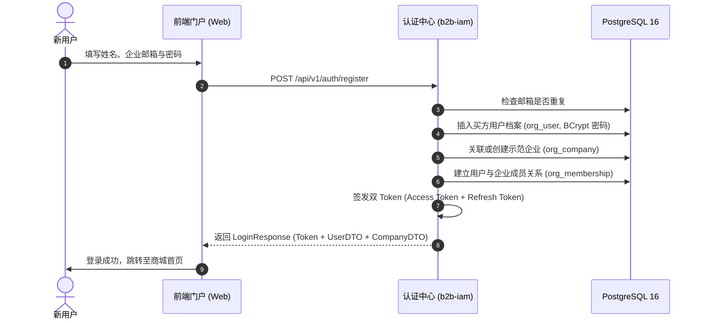

# 05 - 前端买方门户 MVP 接口对齐与能力补全设计文档

本文档记录针对前端项目 `b2b-portal-web` 的架构对齐、接口补齐与数据模型改造方案，确保买方门户 MVP 所有核心页面（登录/注册、选品/商品详情、批量采购、采购车、结算、订单中心、促销中心、企业空间）的数据均由后端服务真实提供。

---

## 1. 业务背景与用例分析

前端 `b2b-portal-web` 核心用例与交互链路如下：
1. **认证与空间** (`/login`, `/account`)：
   - 支持买方用户账号密码登录；
   - 支持新买方用户自主注册并直接建立采购会话；
   - 支持切换所属客户企业（多租户上下文）；
   - 展示企业资质认证、总授信/可用额度与账期天数；
   - 管理当前企业有效收货地址与开票资质（新增、设为默认、删除）。
2. **选品与商品目录** (`/products`, `/products/[id]`)：
   - 多维筛选检索：支持关键词、品类、品牌、现货状态与排序（推荐、最新、价格升降）；
   - 商品卡片展示：包含背景色调 (`tone`)、强调色 (`accent`)、品牌缩写 (`mark`)、角标 (`badges`) 及标签 (`tags`)；
   - 商品详情：支持多规格 SKU 切换、阶梯价格区间实时计算与加购。
3. **批量采购** (`/bulk-buying`)：
   - 买方粘贴多行文本清单（`SKU-编码 + 数量`）；
   - 调用后端解析接口逐行匹配有效 SKU、库存与阶梯单价，并返回关联商品详情（用于前端渲染视觉卡片）；
   - 过滤有效行一键加入采购车。
4. **采购车与结算** (`/cart`, `/checkout`)：
   - 采购车增删改查、数量步进重算阶梯价、全选/单选联动金额；
   - 结算页防重 Token 预领、企业授信预检与两阶段审批订单提交。
5. **营销与促销活动** (`/promotions`, 首页 Banner)：
   - 展示进行中的促销活动（协议优惠、传感器批量折扣、满减券、免运费）；
   - 结算页与采购车联动活动优惠试算。

---

## 2. 领域模型与时序交互设计

### 2.1 批量采购与快速加购时序



### 2.2 用户自主注册与登录时序



---

## 3. 接口契约定义

### 3.1 买方自主注册
- **URL**: `POST /api/v1/auth/register`
- **Request Body**:
  ```json
  {
    "name": "林悦",
    "email": "lin.yue@example.com",
    "password": "password123",
    "companyName": "深圳市蓝图精密制造有限公司"
  }
  ```
- **Response**: `ApiResponse<LoginResponse>`

### 3.2 促销活动查询
- **URL**: `GET /api/v1/promotions`
- **Response**: `ApiResponse<List<PromotionDTO>>`

### 3.3 企业地址管理
- `GET /api/v1/finance/addresses`: 获取地址列表
- `POST /api/v1/finance/addresses`: 新增地址
- `PUT /api/v1/finance/addresses/{id}/default`: 设为默认地址
- `DELETE /api/v1/finance/addresses/{id}`: 删除地址

### 3.4 企业开票资质管理
- `GET /api/v1/finance/invoices`: 获取开票资质列表
- `POST /api/v1/finance/invoices`: 新增开票资质
- `PUT /api/v1/finance/invoices/{id}/default`: 设为默认开票资质
- `DELETE /api/v1/finance/invoices/{id}`: 删除开票资质

---

## 4. 数据库与 SQL 设计

### 4.1 营销促销表 DDL (`mkt_promotion`)

```sql
CREATE TABLE IF NOT EXISTS mkt_promotion (
    id VARCHAR(64) PRIMARY KEY,
    code VARCHAR(64),
    title VARCHAR(255) NOT NULL,
    description TEXT,
    type VARCHAR(32) NOT NULL,
    scope VARCHAR(32) NOT NULL,
    category_ids JSONB,
    product_ids JSONB,
    sku_ids JSONB,
    starts_at TIMESTAMPTZ NOT NULL,
    ends_at TIMESTAMPTZ NOT NULL,
    is_active BOOLEAN NOT NULL DEFAULT true,
    discount_rate NUMERIC(10, 4),
    discount_amount NUMERIC(12, 2),
    min_subtotal NUMERIC(12, 2),
    min_quantity INT,
    max_discount NUMERIC(12, 2),
    tiers JSONB,
    stackable BOOLEAN NOT NULL DEFAULT false,
    priority INT NOT NULL DEFAULT 0,
    created_at TIMESTAMPTZ NOT NULL DEFAULT CURRENT_TIMESTAMP,
    updated_at TIMESTAMPTZ NOT NULL DEFAULT CURRENT_TIMESTAMP
);

CREATE INDEX IF NOT EXISTS idx_mkt_promo_active_priority ON mkt_promotion(is_active, priority DESC);
CREATE INDEX IF NOT EXISTS idx_mkt_promo_dates ON mkt_promotion(starts_at, ends_at);
```

### 4.2 字段与快照考量
1. **JSONB 结构**：
   - `category_ids`, `product_ids`, `sku_ids` 存储适用范围数组，兼容未来多商品组合活动；
   - `tiers` 存储阶梯档位配置，支持特定采购量对应的优惠率与单价。
2. **多租户与安全性**：
   - 促销活动属于商城平台级（Marketplace）营销资产，面向处于生效窗口的入驻企业开放；
   - 结算时由纯内存无副作用算价流水线校验企业身份与活动资格，计算结果快照至订单子项中。
3. **Flyway 版本号**：
   - 本变更沉淀为 `b2b-bootstrap/src/main/resources/db/migration/V1.0.4__add_promotions_and_features.sql`。
